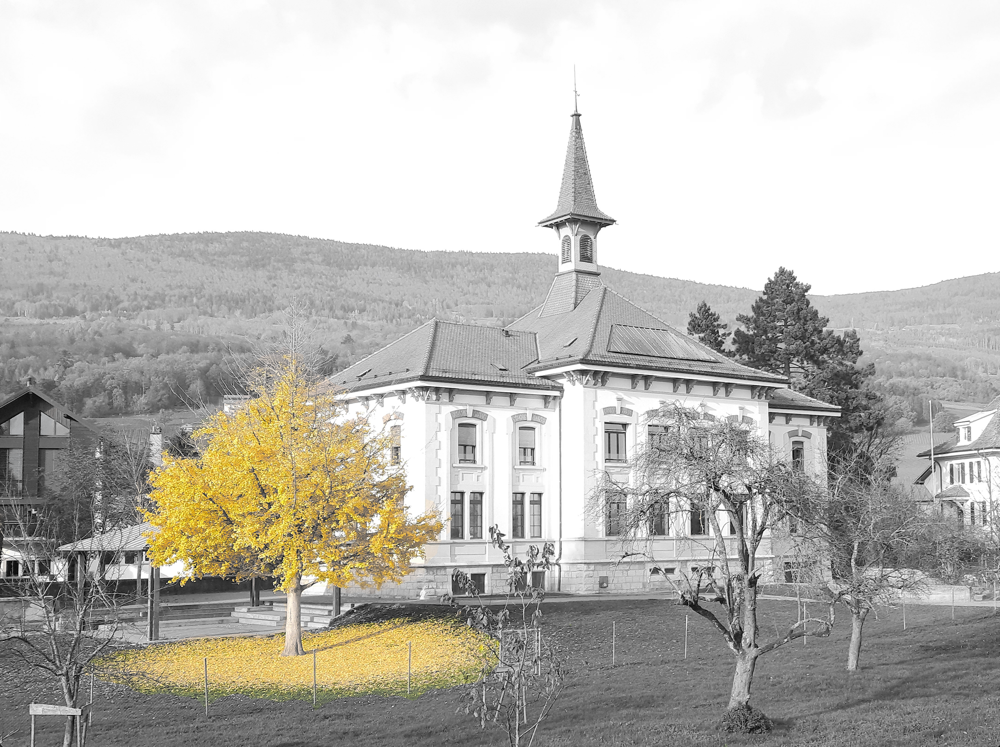

# color_isolation.py
Python program used to easily color isolate a specific part of a picture.

	

## Table of contents
* [1. Description](#1-description)
* [2. Getting started](#2-getting-started)
    * [2.1 Dependencies](#21-dependencies)
    * [2.2 Installing](#22-installing)
    * [2.3 Executing program](#23-executing-program)
* [3. Version history](#3-version-history)

<!-- toc -->

## 1. Description
`color_isolation.py` is a Python program leveraging OpenCV and its HSV filtering
capabilities to color isolate a specific part of a picture.

Here are the consecutive process steps:
1) The user executes the program and the HSV version of the input picture appears
2) The user clicks 5 times on several places on the object he wants to color
isolate. This step allows to record samples of HSV values
3) Based on these values, an average of the HSV values will be elaborated and
the HSV range is computed
4) Using the HSV range and the `cv2.inRange` function, the mask isolating the
object of interest is created
5) Using the same mask, the region of the object of interest is black-outed from
a grayscaled version of the input picture and the original colored object is
added at this precise location

	

## 2. Getting started

### 2.1 Dependencies
* Tested on macOS Big Sur version 11.0.1
* Python 3.7

### 2.2 Installing
For testing `color_isolation.py`, install the required packages by typing
following Terminal command at the root of the project:

`pip install -r requirements.txt`

### 2.3 Executing program
The `color_isolation.py` script can be run by typing following Terminal command
at the root of the project:

`python3.7 color_isolation.py`

## 3. Version history
* 0.1
    * Initial release